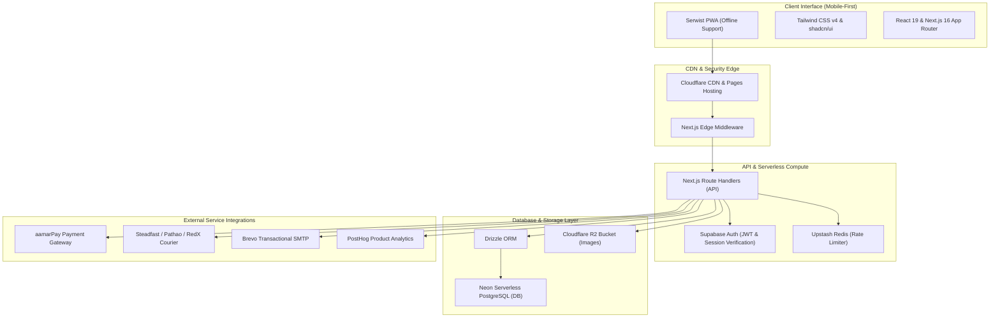

# Tech Stack Matrix & Architectural Justification
## Varito Solutions | Zero-Budget High-Performance Commercial Architecture

> **NOTE**
> This document details the exact, compiled tech stack utilized in the Varito Solutions project. 
> Every technology, library, and cloud service has been meticulously selected to meet a strict **zero-fixed-cost** requirement while delivering premium, high-scale performance tailored for the mobile-first Bangladeshi market.

---

## 🏗️ Core Architecture Map



---

## 📦 Detailed Stack Breakdown

### 1. Framework & Language Core

| Technology | Exact Version | Purpose in Codebase | Technical & Financial Justification (Why) |
| :--- | :--- | :--- | :--- |
| **Next.js** | `16.2.6` | Whole-App Framework (App Router) | Combines static generation (SSG) for fast loading, Server-Side Rendering (SSR) for robust SEO indexing, and API routes in a unified serverless environment. Fully compatible with Cloudflare Edge. |
| **React** | `19.2.4` | Component Rendering & Hooks | Harnesses modern state management, Server Actions support, and hydration performance improvements native to React 19. |
| **TypeScript** | `^5` | Static Code Typing | Guarantees strict type safety, prevents compile-time mistakes, and streamlines data contracts between the database schema and frontend UI components. |

---

### 2. Styling & UI Design System

> **TIP**
> The design system is set up using custom-tailored emerald theme tokens. All UI components strictly use solid, high-contrast, premium colors (avoiding cheap-looking gradients) for a high-end commercial aesthetic.

| Technology | Exact Version | Purpose in Codebase | Technical & Financial Justification (Why) |
| :--- | :--- | :--- | :--- |
| **Tailwind CSS** | `^4` | Main Styling Utility | Utility-first styling. Tailwind v4 introduces native CSS variable-based configuration, container queries, `:has()` support, and extremely fast compilation speeds. |
| **@base-ui/react** | `^1.5.0` | Headless Unstyled UI Components | Replaces heavy UI libraries. Provides fully accessible, unstyled primitives (like Dialogs, Selects, and Popovers) that meet WCAG standards, fully customized via Tailwind classnames. |
| **class-variance-authority** | `^0.7.1` | Component Variant Tool | Empowers clean declaration and construction of responsive, multi-variant UI elements (such as `Button` sizes and themes). |
| **lucide-react** | `^1.16.0` | Application Vector Icons | Complete, highly optimized SVG vector icons pack configured natively as React elements. |

---

### 3. Database & Object Relational Mapper (ORM)

| Technology | Exact Version | Purpose in Codebase | Technical & Financial Justification (Why) |
| :--- | :--- | :--- | :--- |
| **Neon PostgreSQL** | `@neondatabase/serverless` | Production Relational Database | Serverless Postgres database with an excellent **0.5GB free tier** and scale-to-zero compute auto-suspend, providing zero database idling costs. |
| **Drizzle ORM** | `^0.45.2` | Database ORM & Migrations | Fully type-safe, lightweight database mapper. Generates optimized parameterized queries, supports edge execution engines, and integrates natively with Neon serverless pools. |
| **drizzle-kit** | `^0.31.10` | Migration Management tool | Synchronizes schemas and compiles migration scripts into plain SQL in the `./drizzle` folder. |

---

### 4. Authentication & Security

| Technology | Exact Version | Purpose in Codebase | Technical & Financial Justification (Why) |
| :--- | :--- | :--- | :--- |
| **Supabase Auth** | `@supabase/supabase-js` | Client-Side Auth & Session Handlers | Provides extremely robust email/password auth and SMS OTP gateways. **Free for up to 50,000 monthly active users (MAUs)**. |
| **@supabase/ssr** | `^0.10.3` | Middleware & API route auth helpers | Automates session and cookie verification on the server-side, protecting all admin routes at the Next.js edge middleware. |

---

### 5. Third-Party Integrations & Logistics

> **IMPORTANT**
> All third-party logistics and gateway integrations are decoupled via clean utility libraries (located in `src/lib/`), ensuring fast swapping or updating.

| Technology | API Casing/Protocol | Purpose in Codebase | Technical & Financial Justification (Why) |
| :--- | :--- | :--- | :--- |
| **aamarPay Gateway** | REST API (`lib/aamarpay.ts`) | Customer Checkout Payments | The only payment gateway in Bangladesh with **zero setup fee** and **zero monthly maintenance fee**. Handles bKash, Nagad, Rocket, Visa, and Mastercard transactions natively. |
| **Steadfast Courier** | API-Key REST integration | Admin Order Shipment Booking | The primary courier integration for automated home-delivery bookings inside Bangladesh. |
| **Pathao Courier** | Client-Credentials OAuth | Secondary Courier Integration | High-speed intra-city delivery option with real-time token exchange and automated routing. |
| **RedX Courier** | Token-based REST API | Tertiary Courier Integration | Fallback courier API configuration for wide geographical reach. |

---

### 6. Storage & Infrastructure Utilities

| Technology | Exact Version | Purpose in Codebase | Technical & Financial Justification (Why) |
| :--- | :--- | :--- | :--- |
| **Cloudflare R2** | `@aws-sdk/client-s3` | Product Images Storage | S3-compatible cloud object storage. **10GB free storage tier** with **ZERO egress/bandwidth fees**, making it perfect for hosting high-fidelity product images without bandwidth shock. |
| **Brevo SMTP** | REST API (`lib/brevo.ts`) | Transactional Notifications | Sends automated order confirmations and shipping updates. **Free for up to 9,000 emails/month** (300 per day), which completely bypasses the deprecated SendGrid free tiers. |
| **Upstash Redis** | `@upstash/redis` | Serverless Rate Limiting | Edge-ready serverless Redis cache. Handles API route rate limiting (e.g. 5 attempts/minute for auth) to shield database pools from brute-force attacks. **10,000 daily commands free**. |

---

### 7. Progressive Web App (PWA) & Analytics

| Technology | Exact Version | Purpose in Codebase | Technical & Financial Justification (Why) |
| :--- | :--- | :--- | :--- |
| **Serwist** | `@serwist/next` | Service Worker & Cache Manager | Progressive Web App engine replacing `next-pwa`. Caches files and routes offline, and triggers the mobile "Add to Home Screen" installation banner. |
| **PostHog** | `^1.375.0` | Product Analytics & Funnels | Generates product analytics, funnels, click maps, and session replays. **Free for up to 1,000,000 events/month** + 5,000 session replays. |

---

## 💰 Monthly Cost Matrix (Commercial Viability)

| Layer | Technology | Free Tier Scope | Standard Monthly Cost |
| :--- | :--- | :--- | :--- |
| **Hosting & DNS** | Cloudflare Pages | Unlimited Bandwidth, SSL, custom domain | **$0.00** |
| **Compute Engine** | Next.js on Edge | Unlimited edge runtime compute execution | **$0.00** |
| **Database** | Neon PostgreSQL | 0.5GB data size, scale-to-zero compute | **$0.00** |
| **Image Storage** | Cloudflare R2 | 10GB storage size, zero bandwidth fees | **$0.00** |
| **Identity System** | Supabase Auth | 50,000 Monthly Active Users | **$0.00** |
| **Rate Limiter Cache** | Upstash Redis | 10,000 commands per day | **$0.00** |
| **Email Server** | Brevo SMTP | 9,000 transactional emails/month | **$0.00** |
| **Product Analytics** | PostHog | 1,000,000 analytics events/month | **$0.00** |
| **Payment Gateway** | aamarPay | Zero setup fee (pay per transaction only) | **$0.00** (Fixed) |
| **Total Fixed Cost** | — | — | **৳ 0.00 (Zero Taka/Month)** |

---

## 📈 Scalability Pathway

When Varito Solutions exceeds the limits of the free tiers, the architectural pathway to scale is completely seamless and does not require rewrite:

```
[Neon Postgres Free (0.5GB)] ───> [Neon Postgres Pro ($19 + usage)]
[Cloudflare R2 Free (10GB)]   ───> [R2 Overages ($0.015/GB)]
[Brevo Email Free (9K/mo)]    ───> [Brevo Starter ($25/mo for 20K)]
[PostHog Analytics (1M/mo)]   ───> [Pay-as-you-grow ($0.0001/event)]
```

*Compiled and verified by the Antigravity Quality Gate Inspector.*
